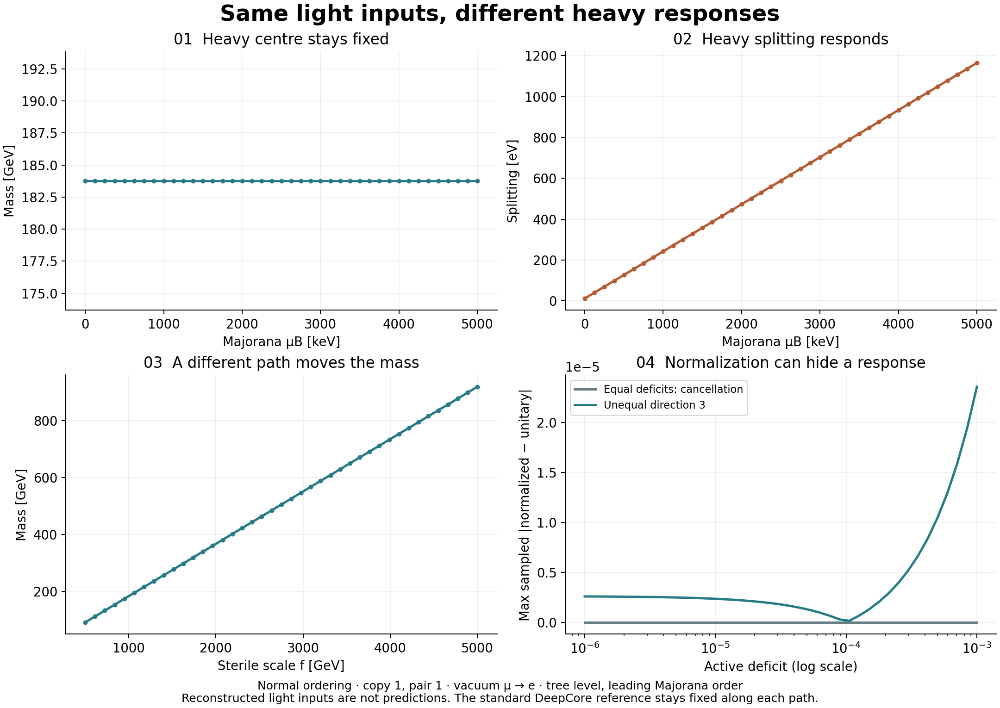

# 🔧 GHU Lab — the source tree of the gauge–Higgs unification instrument

This repository builds **[the GHU research laboratory](https://karlesmarin.github.io/ghu-explorer/)**:
a self-contained browser instrument for model building, Wilson-line potentials, spectra,
anomalies, thermal transitions, neutrino physics and experimental comparisons. It includes the
original SU(7), SU(4) and general 5D SU(N) tools, flat and warped SU(6) benchmarks, thermal SU(3),
the 4D neutrino ring, Higgs-rate scenarios, integrated diagnostics and reproducible batch studies.
Outputs retain their inputs, provenance and status: `theorem`, `verified`, `measured` or `unknown`.

## User guides · 9 October 2026

[English](https://karlesmarin.github.io/ghu-explorer/guide/index.html)
· [Castellano](https://karlesmarin.github.io/ghu-explorer/guide/es/index.html)
· [Getting started](https://karlesmarin.github.io/ghu-explorer/guide/getting-started/index.html)
· [Spanish manual (PDF)](https://karlesmarin.github.io/ghu-explorer/guide/manual/ghu-lab-guide-es.pdf).

The searchable guide index organizes tasks and model families. **42 guides** cover the 29 menu
sections, three Simulator modes, eight embedded experiments, neutrino decays and getting started;
these overlap and are not a count of independent panels. Each guide explains controls, outputs,
an example, assumptions, troubleshooting and source attribution. The 59-term glossary and inline
help share the English/Spanish catalogues, so scope corrections reach both places.

The application links each section, mode and experiment to its guide. Help language persists without
resetting the calculation; full guides open separately. The website pages remain readable without
JavaScript and have canonical URLs and reciprocal language alternatives. The root
[sitemap](https://karlesmarin.github.io/ghu-explorer/sitemap.xml) is generated from current pages,
including both guide languages; archived artifacts remain accessible through Editions.

Maintain `docs/user-guides.json` and `docs/user-guides.es.json`; rebuild with
`python build/guide_manual.py` (pdfLaTeX and Babel), `python tools/laboratory_inventory.py`,
`python build/build_app.py --browser`, then `python build/build_site.py --legacy <legacy-directory>`.
Run `node build/guide_pages.mjs` to check the generated guides in desktop and mobile Chromium.
The Spanish manual uses Babel’s `spanish,es-noshorthands,es-nodecimaldot,es-tabla` options.
Babel handles typesetting; translations are explicit source content. Guide checks reject missing
tools, wrong mode/focus routes and formula differences between languages. The corrected glossary
keeps gauge-seed parity, moment ceilings, boundary assumptions and experimental comparisons scoped.

### Formula consistency corrections · 8 October 2026

The SU(N) minimizers now report the same **V/C** as the potential evaluator: the extra
factor ½ in their depths and endpoint difference has been removed. The located phases
are unchanged. Symmetry breaking is evaluated from the joint commutant relative to
θ = 0, including boundary minima and rearrangements with equal group dimensions.
For example, the SU(3) model with two periodic fundamental Dirac fermions has its
minimum at θ = 1 and changes SU(2)×U(1) to U(1)². A boundary flag alone cannot decide this.

The simulator uses analytic Fourier Hessians with a truncation-error bound. Its JSON
records the evaluated phase, actual coupling, derivative method and numerical search
status. A probe is labelled as a probe. The comb, spacing table and bound download now
share one convention gate; upper bounds do not establish attainable masses or a full
theory exclusion. The K comparison depends on potential normalization when m_h is held fixed.

The literature anchor remains open. SageMath proves that F′ excludes zero throughout
the rounding intervals of all five printed SU(7) phases **for the implemented potential**.
This bounds the disagreement; it does not validate the field-content transcription or
prove the paper wrong. Maru–Nago's printed phase also differs from the infinite-sum
stationary point; its proximity to a ten-term result does not establish the authors'
numerical procedure. The earlier Haba–Yamashita absolute-value claim remains withdrawn.

The [independent Sage proof](proof/formula_consistency.py), its
[interval results and source links](data/formula_consistency_reference.json), and
[regressions](_test_formula_consistency.mjs) accompany the correction.
Reproduce the live probe with `node build/formula_consistency_probe.mjs`, then run
`sage -python proof/formula_consistency.py` from this repository (SageMath 10.9;
the local Docker image is `sagemath/sagemath`). The normal build includes the new
regressions and browser checks. These checks cover the stated identities and cases;
they do not certify every model or the global optimum of a numerical search.

The bilingual video revision of 8 October includes new captures and corrected explanations,
with synchronized captions and chapter times. The original 7 October guide remains available
from the video page as a historical version; frozen editions retain their original checkpoint.

The 5D family goes from a boundary condition to numbers a detector measures: the Wilson-line
potential of **any** SU(N) model, its vacuum, the four-dimensional spectrum there, the anomaly
ledger, the matter on the two fixed points that pays that ledger and gives the unwanted zero modes
a mass, which of those verdicts are properties of the theory rather than of the frame, whether
SU(3)×SU(2)×U(1)_Y with a full generation is inside it, and then the **Simulator** — 1/R from the
measured W mass, the Higgs mass from the curvature of the potential, sin²θ_W against the running
of the data, the Kaluza–Klein towers in GeV against the CMS dijet bound, and the masses the
Wilson line gives the fermions. Every measured number carries its source and the date it was
read; no event is ever simulated.

## 🎬 Learn by watching · Aprende con el vídeo

**[English video guide](https://karlesmarin.github.io/ghu-explorer/video/index.html?lang=en) · [Guía en español](https://karlesmarin.github.io/ghu-explorer/video/index.html?lang=es)**

Two narrated Full HD versions demonstrate the real interface in **43 chapters**: all **29 menu
sections**, the **3 Simulator modes**, the **8 research cards**, integrated diagnostics and exports.
Each chapter connects a question, a control change and the result, with the assumptions needed
to interpret it. Use the searchable chapter list, subtitles, transcript and MP4 download. Changing
language preserves your position within the chapter. Narration is synthetic; the interface keeps
its English button labels. The certification revision of **8 October 2026** contains
**139 scenes per language**, with demonstrations of formal and interval certificates,
moment errors, uncertainty, ATLAS/CMS references and the thermal solver comparison.
Earlier guides from 7 October and the first 8 October release remain available from the player.

🇪🇸 **Cómo empezar:** abre la guía, elige Español y busca el módulo. Pulsa Reproducir y usa la
pantalla completa para leer las gráficas. «Probar esta sección» abre el laboratorio. Cambia una
entrada, compara la respuesta y exporta los resultados junto con sus hipótesis.

🇬🇧 **Getting started:** open the guide, choose English and find your module. Press Play and use
full screen for the figures. “Try this section” opens the laboratory. Change one input, compare
the response, and export the results with their assumptions.

The chapter count describes the tutorial; it does not add new navigation panels or scientific
models. Representative controls are demonstrated, rather than every possible input combination.

## 🧭 What the laboratory contains

| Layer | Current inventory | Where to find it |
|---|---|---|
| 🗂️ Navigation | **29 menu sections**, covering model construction, spectra, anomalies, vacua, orbifolds, collider comparisons and research diagnostics | The complete section catalog below, in the actual menu order |
| 🔮 Simulator models | **3 modes:** the 5D SU(N) builder, Higgs production from a top KK tower, and the 4D neutrino ring | [Simulator](https://karlesmarin.github.io/ghu-explorer/app/index.html#s=predict) → model selector |
| 🧪 Embedded experiments | **8 dedicated experiment cards:** Maru–Nago SU(6), warped SU(6) running, three active flavours, fixed-light-input neutrino paths, thermal potential, integrated transition history, RS anomaly flow and HiggsTools | Inside Paper models, Brane kinetic terms, Simulator, Anomalies & proton and Collider |
| 📊 Integrated analyses | SU(7) robustness; CMS HNL comparisons; neutrino decays, lifetime, flight and coherence with optional computed Majoron channels; conditional rung certificates and full-potential witnesses | Hierarchy, Simulator → Neutrino ring, and Screen a table |
| 🔬 Reproducible studies | **4 archived batch studies:** Higgs coupling/width assumptions, thermal assumptions, candidate vacuum screening and fixed-light-input neutrino paths | [Higgs/thermal/vacuum studies](docs/research-exploration-2026-10-07.md) · [Neutrino study](research/2026-10-07-neutrinos/README.md) |
| ⚙️ Scientific engines | **PhaseTracer** for bounce actions and **HiggsTools** for scalar-rate tests with pinned HiggsBounds/HiggsSignals datasets | Optional local engine; saved benchmark results remain available offline |
| 🧾 Experimental references | CMS dijet and HNL limits, ATLAS/CMS Higgs datasets, archived IceCube DeepCore 2018 maps, NuFIT flavour inputs and named PDG inputs, with the hypothesis and provenance of each comparison | The relevant result cards, guides and JSON exports |

**How the counts work:** 29 counts navigation entries. The three Simulator modes and eight
experiment cards describe what is available inside those entries. The ten October additions
below comprise those eight cards plus the Majoron and conditional-bound extensions. These
overlapping inventories are not added into an artificial total of independent panels.

[📋 Full laboratory map and first experiments](docs/laboratory-inventory.md)
· [🔎 Inventory checked against the source](docs/laboratory-inventory.json)
· [▶️ Open the laboratory](https://karlesmarin.github.io/ghu-explorer/app/index.html).

<a id="research-experiments-added-in-october-2026"></a>

## 🔬 Research experiments added in October 2026

**Eight experiment cards and two extensions to existing analyses.** The section links below open the
public app; the route names tell you which experiment to select inside that panel. These cover
separate flat, warped, neutrino and scalar scenarios. Each calculation states its own action,
inputs and limits; sharing the instrument does not make them a combined GHU fit.

| Experiment · where to open it | What you change and what it computes | First comparison and scope |
|---|---|---|
| **🧩 Maru–Nago SU(6): Type 2 / Type 3 families** · [Paper models](https://karlesmarin.github.io/ghu-explorer/app/index.html#s=papers) → **Maru–Nago SU(6)** | Vary the Type 3 generation count k₃, adjoint Dirac copies and Fourier cutoff. Read the Wilson potential, a magnified view of its minimum, the published reference and a convergence table. **Load into the SU(N) builder** transfers the supported bulk potential. | Start with k₃=3, N_ad=5 and compare 10 with 1000 Fourier terms. The comparison exposes truncation sensitivity; it does not certify the Higgs mass, the lifting of adjoint exotic zero modes or complete flavour consistency. |
| **🌌 Warped SU(6): differential running and UV brane terms** · [Brane kinetic terms](https://karlesmarin.github.io/ghu-explorer/app/index.html#s=blkt) → **Warped SU(6)** | Switch the C1/C2 matter assignment; vary IR/UV scales and the two boundary-coupling differences. Plot α₂⁻¹−α₁⁻¹ and α₃⁻¹−α₁⁻¹, read the required Δλ values and residuals, and inspect a separate UV localization/mass probe. | Compare C1 with C2, then set the chosen Δλ values to the required ones. This is one-loop differential running with approximate IR matching. The NDA reference is a scale estimate, and the localization probe is separate from the C1/C2 spectrum. |
| **🧬 Three active flavours: a rank 2 or rank 3 ring extension** · [Simulator](https://karlesmarin.github.io/ghu-explorer/app/index.html#s=predict) → **Neutrino ring** → **Three active flavours** | Choose normal/inverted ordering, the lightest mass, PMNS angles and phases, and active-deficit directions. Three sterile copies reconstruct Yukawa columns, the light mass matrix and 18 heavy-pair flavour weights. Read Σmν, mβ, mββ, J_CP, a flavour map and vacuum oscillation curves. | Compare the NuFIT 6.1 normal/inverted presets and vary δ. Masses and PMNS orientation are supplied inputs, not predictions. Separate NuFIT ranges do not define a joint likelihood; the oscillation plot uses the unitary vacuum limit. |
| **🔬 Fixed light inputs: what can distinguish the neutrino ring?** · [Simulator](https://karlesmarin.github.io/ghu-explorer/app/index.html#s=predict) → **Neutrino ring** → **Fixed light inputs** | Sweep μB, f, t/q/r, a common active deficit or one deficit direction while reconstructing the same light masses and PMNS orientation. Five linked figures show heavy centres, pair splitting, raw/near-normalized vacuum current factors, magnified differences and the archived DeepCore map. | Compare the three presets. Equal deficits cancel in the stated near normalization; unequal deficits can leave a shape response. DeepCore 2018 is a standard-three-neutrino reference, not a ring likelihood; it is not combined with NuFIT. [Method and first experiment](docs/neutrino-identifiability.md). |
| **✨ Computed Majoron decay channels** · [Simulator](https://karlesmarin.github.io/ghu-explorer/app/index.html#s=predict) → **Neutrino ring** → **Decays** | Enable the computed Majoron widths, choose a heavy pair and vary the scalar VEV ratios. The physical, canonically normalized Majoron direction gives light and heavy cascade widths that enter the scenario lifetime and SS/OS diagnostic; overlap warnings identify where isolated-pair treatment fails. | Compare channels disabled/enabled at the same fermion mass matrix. The reference leaves them disabled; that setting is not a claim that they are absent. The calculation is at leading Majorana order; the scalar vacuum and additional radial channels remain outside its scope. [Equations and independent checks](docs/neutrino-majoron.md). |
| **⚖️ RS anomaly flow and baryon current** · [Anomalies & proton](https://karlesmarin.github.io/ghu-explorer/app/index.html#s=anomalies) → **RS anomaly flow** | Vary the Wilson angle, warp factor, selected Z mode and quark/lepton generation counts. Normalized gauge profiles give the UV/IR anomaly factors and their sum, the mode masses and a neutral baryon-current matrix. Compare normalization quadratures and the paper's fixed finite-KK reference table. | Remove one lepton generation, then restore it. Gauge-anomaly cancellation and baryon-current violation are distinct outputs. The published finite fermion-KK sums are reference data, and no proton lifetime or baryogenesis yield is inferred. |
| **🌡️ Finite-temperature GHU: Wilson potential and phase coexistence** · [Simulator](https://karlesmarin.github.io/ghu-explorer/app/index.html#s=predict) → **SU(N) builder** → **Finite-temperature GHU** | Load either Hirose–Shibuya SU(3) case; vary matter content, temperature, coupling and compactification scale. Inspect the potential, its minima, phase flow, coexistence temperature and doubled-cutoff comparison. A matching **PhaseTracer** calculation supplies an actual O(3) bounce. | Compare cases 1 and 2 and distinguish coexistence from the S₃/T=140 nucleation proxy. This thermal SU(3) benchmark has its own inputs; it is not the thermal history of whichever SU(N) model is loaded in the builder. |
| **🫧 Integrated nucleation, percolation and conditional gravitational waves** · [Simulator](https://karlesmarin.github.io/ghu-explorer/app/index.html#s=predict) → **SU(N) builder** → the integrated-history experiment | Refined PhaseTracer actions feed the bubble-growth integral, false-vacuum fraction, separate nucleation/percolation/completion temperatures and mean bubble separation. Vary g*, wall speed, fluid efficiency and expansion background; inspect the conditional acoustic spectrum and convergence diagnostics. | Load case 1 and change efficiency or wall speed. Completion must reduce the physical false-vacuum volume. The acoustic fit is evaluated only in its supported completed, weak-transition, fast-wall regime; wall dynamics and detector significance are not calculated. |
| **💥 Higgs rates, total width and experimental tests** · [Collider](https://karlesmarin.github.io/ghu-explorer/app/index.html#s=collider) → **Higgs rates** | Set κV, κF, κg, κγ, κZγ and an invisible width for a 125.2 GeV CP-even scalar. Compute all partial widths, branching fractions, signal strengths and production rates at 8, 13, 13.6 and 14 TeV. Matching **HiggsBounds/HiggsSignals** evaluations retain the selected limit, χ² and dataset provenance, including ATLAS/CMS results. | Save the SM reference, load the top-tower scenario, then add invisible width. A top-tower correction alone is not a complete GHU fit. The 159-observable reference is not 159 independent degrees of freedom, and χ² is not automatically a confidence level. |
| **🔎 Conditional rung bounds and full-potential witness checks** · [Screen a table](https://karlesmarin.github.io/ghu-explorer/app/index.html#s=screen) → **Conditional rung bounds** | Select the seed and read interval certificates for the listed even candidate or odd published rungs, with their coupling and mass-window conventions. Inspect independent full-Fourier witness checks, competing vacua, tail errors and the certificate JSON. | Compare a candidate stationary example with one marked **deeper minimum elsewhere**. The certificates bound the small-angle moment relaxation; they neither prove a universal full-potential ceiling nor guarantee an attainable model. |

**🎛️ Working with the experiment cards.** Read **What this tests**, choose a reference and press
**Use this point as comparison**. Change one parameter, compare the indicators and curves, then
save a research summary, the complete JSON or a selected SVG figure. Numerical tables, matrices
and precision controls can be expanded when needed. Permalinks retain controls; saved comparisons
and external calculation records travel in JSON. The Majoron controls stay in the existing decay
card, and the rung-bound table has its own certificate export.

**⚙️ Offline references and new calculations.** Browser calculations and stored benchmark results
work offline. New HiggsTools/PhaseTracer points require the optional local scientific engine or
an imported matching result. Changing inputs withdraws an unmatched external verdict. Integrated
history additionally needs refined action samples; the ordinary bounce button does not prepare
those samples automatically. From a clone of the [source repository](https://github.com/karlesmarin/ghu-lab),
with Docker Desktop available:

```text
python tools/backend.py setup
python tools/backend.py serve
```

**🔧 The existing tools also moved.** **Count a rung** now draws on entry and after extending its
range; candidate-seed curves use the half-integral A₄ grid. Published mass fibres and benchmarks
are not transferred to that seed. **Screen 3** draws the candidate arithmetic comb and keeps its
conditional certificates and physical-vacuum checks distinct from an arithmetic match.

[Routes, equations, sources and scientific-engine setup](docs/research-extensions.md)
· [🧬 Three-flavour inputs and unitary-limit oscillations](docs/neutrino-flavour.md)
· [Export formats and provenance](docs/result-card.md)
· [Earlier three batch studies: Higgs assumptions, thermal history and candidate vacua](docs/research-exploration-2026-10-07.md)
· [JSON records and figures](research/2026-10-07/README.md).


### 🔬 Neutrino research: fixed inputs, distinguishable responses

Open **Simulator → Neutrino ring → Fixed light inputs**. Start with **Heavy splitting at fixed
light inputs** and move the selected sweep position from `0.1` to `0.8`. Then compare **Common
suppression hidden by normalization** with **Unequal deficits and flavour shape**. The fourth
figure magnifies the absolute difference that is difficult to see in overlapping curves.



The [archived study](research/2026-10-07-neutrinos/README.md) contains **738 scan points**:
nine paths × two orderings × 41 points. At the normal-ordering defaults, sweeping μB from 0 to
5000 keV leaves the selected centre at 183.7744 GeV while its splitting spans 11.4770–1164.6868 eV.
These are tree-level leading-Majorana calculations. The light inputs are reconstructed by design.

The fifth figure uses real, archived **IceCube DeepCore 2018** data: two 51 × 51 reference maps,
with signed mass-splitting conventions and the supplied normal-ordering Feldman–Cousins contour.
There is no extrapolation, ordering-odds claim, ring exclusion or sum with the NuFIT reference.
Every SVG carries its samples and provenance. The [guide](docs/neutrino-identifiability.md)
explains normalization, current limits, data hashes and reproduction commands.


### 🧰 Model views and diagnostics available alongside the experiments

| Tool | What you can do | Guide |
|---|---|---|
| 📐 **Hierarchy → Robustness of this content** | Vary g₄, propagate the recorded W-mass uncertainty and compare winding cutoffs in three separate response plots. Inspect actual m_h and 1/R₅ shifts and export each SVG with its sampled values. | [Robustness](docs/diagnostics.md) |
| 🔮 **Simulator → Higgs production · top KK reference** | Vary MKK, top mass and cutoff; compare the leading rate, finite KK sum and resummed low-energy-theorem reference. Inspect the conditional interval, numerical tail and historical or user-supplied rate window. | [Higgs-production scope](docs/diagnostics.md#higgs-a-specific-ghu-reference) |
| 🧬 **Simulator → Neutrino ring · 4D research model** | Change ring links and Majorana insertions; read the six heavy pairs, light mass, active deficit, pole residues, protected-pair response and normalization. Calibrate the light inputs or sweep μB while all results move together. | [Ring action and checks](docs/neutrino-ring.md) |
| ⏱️ **Neutrino ring → Decays, lifetime and pair coherence** | Select a pair and combine W/Z/h widths, optional computed Majoron widths and a supplied extra width. Inspect branching contributions, lifetime, cτ, fixed-boost flight probability and ideal coherent-pair SS/OS; three linked figures expose the assumptions and overlap flags. | [Decay conventions](docs/neutrino-decays.md) · [Majoron channels](docs/neutrino-majoron.md) |
| 💥 **Neutrino ring → Compare with published CMS HNL limits** | Choose electron/muon/tau and Dirac/Majorana hypotheses. Compare model reference weights with the observed and expected curves and bands from six official CMS HEPData tables; inspect each pair's ratio and out-of-range status. | [CMS reference and interpretation](docs/neutrino-ring.md#experimental-reference-inside-the-same-panel) |

The top-KK rate window, the HiggsTools scalar scenario and the CMS HNL overlay are separate
comparisons. Their hypotheses remain visible; none is silently combined into a joint GHU likelihood.

## 🔬 The instrument

**Navigation catalog — one row per menu section.** Embedded experiments, Simulator modes and diagnostics are inventoried above. Each name
opens its panel in the public app. This catalog also appears in the
[publication repository](https://github.com/karlesmarin/ghu-explorer#-the-instrument).

| # | Menu section | What it does |
|---|---|---|
| 1 | **[📐 Hierarchy](https://karlesmarin.github.io/ghu-explorer/app/index.html#s=hierarchy)** · Part VII | the compactification scale, the Higgs mass, and the distance to the ceiling under the selected seed and small-angle moment conventions |
| 2 | **[🎯 Design a scale](https://karlesmarin.github.io/ghu-explorer/app/index.html#s=inverse)** · Part VIII | the map run **backwards**: name a compactification scale and get a bulk content — or a *named* certificate that none exists (`floor`, `cone`, `congruence`, an exact rational Farkas `dual`, `exhaustion`), with `budget` reported separately because "we stopped looking" is not "there is none". Above it, the reachable set on a 1/R₅ axis: press once and each cluster resolves into the **finite set of points** it really is — rung one is 35 values, 31.5 GeV apart — and between two clusters sits a certified stretch of **2682 GeV** with nothing in it, 45× the widest gap inside either |
| 3 | **[🔢 Count a rung](https://karlesmarin.github.io/ghu-explorer/app/index.html#s=census)** · Part VIII | how many bulk contents a rung holds, **counted and not built**: a dynamic programme over the two partial moments gives N(A₄, 8D) in about twenty milliseconds where the enumerator took twenty-five minutes, and the four rung totals — 69 022 464 contents — land on what that enumerator built one by one. With the recurrence that makes the four counting curves superpose, and the fibre of the measured-mass point: 81 contents that are not 81 models agreeing but **81 ways to build one potential**, one of 19 multiplets and one of 198. The October update also draws candidate-seed curves automatically on the correct half-integral A₄ grid; the published mass fibre and reference benchmarks remain specific to the published seed |
| 4 | **[🗺️ Atlas](https://karlesmarin.github.io/ghu-explorer/app/index.html#s=atlas7)** · Part VII | every content of at most five multiplets — 1 286 of them — with its potential drawn on one canvas, sorted by α_min and coloured by verdict: one green tile in the Higgs window, and it is their row (2); click any tile to load it |
| 5 | **[🟰 Same potential?](https://karlesmarin.github.io/ghu-explorer/app/index.html#s=samepot)** · Part VII | hold two contents up to Theorem 3: same five coordinates ⟺ identically the same one-loop potential — with the kernel relations as buttons and both potentials drawn |
| 6 | **[⚖️ Anomalies & proton](https://karlesmarin.github.io/ghu-explorer/app/index.html#s=anomalies)** · Part VI | what each multiplet contributes to the bill in eighths, the ladder of odd eighths, and what the escape costs. The separate **RS anomaly-flow experiment** varies the Wilson angle, warp factor and matter generations, displaying normalized Z-mode UV/IR contributions, gauge cancellation and the baryon-current matrix. Published finite KK sums remain fixed reference data; no proton lifetime is inferred |
| 7 | **[🛡️ Escape from proton decay](https://karlesmarin.github.io/ghu-explorer/app/index.html#s=escape)** · Part VI | the escape constructed: type a brane content — rungs, X_Q, q_φ — and get the six channels, the 64-triple rung cube in 3-D, the fourteen assignments, the selection rule and the bill |
| 8 | **[🧩 Multiplets & parities](https://karlesmarin.github.io/ghu-explorer/app/index.html#s=multiplets)** · Parts VI–VII | the layer under the term tables: every representation broken into multiplets with their three Z₂ parities, on a parity cube you turn — where one sign, `s = η·η′·P₅·P′₅`, gives both the zero-mode spectrum and the sign of the potential. The term tables are DERIVED here and checked against the ones the page computes with, and the gauge sector splits by P₆, where one `48(+,+)` cancels it identically in the periodic half |
| 9 | **[🔎 Screen a table](https://karlesmarin.github.io/ghu-explorer/app/index.html#s=screen)** · Parts VI–VII | three tests on someone else's published row, none recomputing their model: the mod-6 law on two integers, the K invariant (what g₄ the row implies), and the arithmetic comb the KK scale must sit on. **Conditional rung certificates** now state the seed, coupling and mass window; the separate full-Fourier checks show whether selected stationary examples have a deeper competing vacuum. A small-angle ceiling does not establish full-potential reachability |
| 10 | **[💥 Collider](https://karlesmarin.github.io/ghu-explorer/app/index.html#s=collider)** · Part VII | which state a dijet search bounds: the wide coloron with no free parameter (√2·g_s saturated, Γ/M = 2α_s), the whole tower as one form factor whose poles are the resonances, the distortion drawn as a draggable relief over (M_jj, χ) — the measurement's own binning — and the ratio table at the recast's own bins, at the model's scale or any 1/R₅ you type. The **Higgs-rates experiment** evaluates a complete scalar scenario with pinned HiggsBounds/HiggsSignals datasets, including ATLAS and CMS results; widths, couplings and the selected experimental limit remain visible. The archived coupling/width scan shows why fixing or profiling the couplings changes the conclusion |
| 11 | **[🚦 Selection rule](https://karlesmarin.github.io/ghu-explorer/app/index.html#s=selection)** · Parts II–III | which α-domain you may legally search — and Part II's three gates: which (a,b,c) can hold a quark generation, with the closed count N = (b+1)(a+c+1)/2 and the minimality of the 60 recovered live |
| 12 | **[🧮 Model calculator](https://karlesmarin.github.io/ghu-explorer/app/index.html#s=calculator)** · Parts IV–V | a matter content in, the Higgs out |
| 13 | **[🌀 η-meter](https://karlesmarin.github.io/ghu-explorer/app/index.html#s=eta)** · Parts IV–V | what the boundary sign does, in closed form — then the field released on the potential |
| 14 | **[🌐 Five dimensions](https://karlesmarin.github.io/ghu-explorer/app/index.html#s=fived)** · Haba–Yamashita 2004 | their own 5D SU(3) model, with the thing their paper calls the hard part and leaves undone — the vacuum — located in the browser; six numbers in, α_min and the KK spectrum out, everything in units of 1/R |
| 15 | **[🏗️ SU(N) builder](https://karlesmarin.github.io/ghu-explorer/app/index.html#s=sun5d)** · Haba–Yamashita 2004 §5 | **the model is the input.** Type a boundary condition — four block sizes, which is what simultaneously diagonal orbifold parities are — and a bulk content, and get the one-loop Wilson-line potential of *any* 5D SU(N) on S¹/Z₂: the unbroken subgroup, how many Higgs degrees of freedom survive, the potential written term by term, and where its minimum is. Every equation of all four worked examples in the source paper is checked against it. And when the model has one Wilson-line phase the terms are the same (m, s, c) triples the SU(7) sections run on, so Part VII's closed form and its five complete invariants apply to somebody else's model — with the page saying which of our results travel to another group and which become measurements you can check |
| 16 | **[📄 Paper models](https://karlesmarin.github.io/ghu-explorer/app/index.html#s=papers)** · four published models | **published models, loaded and checked.** Choose one of four models, compare the authors' statements with the engine's results, and load it into the SU(N) builder so the spectrum, anomalies, brane matter and simulator read that same model. Matches, disagreements and calculations outside the engine's scope are shown separately; checks on supersymmetric papers are limited to the stated parity and field-content results. The **Maru–Nago SU(6) experiment** adds Type 2/3 matter families, adjoint-copy and Fourier-cutoff controls, the full and magnified Wilson-potential plots, published-minimum and convergence comparisons, and transfer of the supported bulk potential to the builder |
| 17 | **[📊 4D spectrum](https://karlesmarin.github.io/ghu-explorer/app/index.html#s=spectrum5d)** · Haba–Yamashita 2004 §3 · Haba–Hosotani–Kawamura 2004 §3 | **what the model contains.** The builder gives the potential and the vacuum; the classes say which models are the same; this says what a model *has* — the four-dimensional fields, with their quantum numbers under the unbroken group. One rule does it: the mode expansion is fixed by the pair of Z₂ parities and only (+,+) has a zero mode. So the massless vectors are the unbroken group, the massless scalars are exactly where they are not — A_y carries the opposite parity, and that is where the Higgs candidates live — and a Dirac fermion gives **one chirality**, which is the whole reason for orbifolding. It shares the builder's model, so changing either panel moves both |
| 18 | **[⚖️ Anomalies](https://karlesmarin.github.io/ghu-explorer/app/index.html#s=anomaly5d)** · Arkani-Hamed–Cohen–Georgi 2001 · Part VI | **what that content owes.** A chiral 4D spectrum is inconsistent unless its gauge anomalies cancel — the first gate a model has to pass, and where an arithmetic slip hides best. Every channel the unbroken group has, [SU(n)]³ and U(1)×[SU(n)]² and U(1)³ and U(1)×[grav]², with an **exact rational** coefficient, so a zero is a zero. The four-dimensional anomaly is the right object because ACG show it lives on the fixed points and cancelling it is *sufficient*; and a non-zero row is not a verdict but a **bill**, since the brane fermions every such model needs — to give the unwanted zero modes mass — pay into the same channels with the opposite sign |
| 19 | **[🧱 Brane matter](https://karlesmarin.github.io/ghu-explorer/app/index.html#s=brane)** · Komori–Maru 2008 · Parts I and VI | **matter on the fixed points, with both jobs checked.** Add left- or right-handed fermions in representations of each boundary's local group and watch the combined bulk-and-brane anomaly ledger and the surviving massless spectrum update together. The panel shows which zero modes can acquire a boundary mass, which extra fields accompany a local representation, and when the charge needed to cancel an anomaly prevents that mass term |
| 20 | **[🔍 Scan](https://karlesmarin.github.io/ghu-explorer/app/index.html#s=sweep5d)** · the four panels, chained | **the model-building loop, closed.** The four panels above answer a question about *one* model; this one walks the space. Every boundary condition of SU(N) on S¹/Z₂ crossed with every bulk content up to a size you choose, through filters ordered **cheapest first** — the unbroken group, a Higgs doublet, chirality, the anomaly ledger, and last the vacuum — so the only expensive one runs on the fewest candidates. The **funnel** is reported stage by stage, because *“three models survive”* says nothing without *“out of how many, and where the others died”*. The headline is a **pair** of numbers: 24 surviving boundary conditions are 16 theories, since [p,q,r,s] ~ [p−1,q+1,r+1,s−1] is the same theory in different coordinates — and the sweep walks conditions rather than classes on purpose, because the apparent unbroken group is *not* a class invariant. An **undecided** vacuum is counted apart from a no. A hit **loads into the builder**, so the loop closes |
| 21 | **[📋 One model, every verdict](https://karlesmarin.github.io/ghu-explorer/app/index.html#s=dossier)** · the five panels, joined | **which of its answers are about the theory at all.** Read one after another the panels above give twenty-nine numbers about one model — and most of the ones read at a symmetric point are *not properties of the model*: they move when the boundary condition is swapped for a gauge-equivalent one, which is the same theory. This page recomputes every line on **every member of the equivalence class** and tags it by what came back — *the theory*, *the frame*, or *declined*, with the reason. The tag is a measurement made on that render, and it found a false verdict on its first run: "is this model anomaly-free?" answered YES for one member and NO for another of the same theory, an empty sum passing a test it had never been given. Then the same questions **at the minimum** of the potential, where they stop moving: with P₁ → W⁻¹P₁ the massless content is a joint eigenspace, and those lines come back invariant on all 86 multi-member classes of SU(4)…SU(7) |
| 22 | **[🔮 Simulator](https://karlesmarin.github.io/ghu-explorer/app/index.html#s=predict)** · HHKY 2004 · CCP 2005 · PDG · CMS | **the model, in the numbers a detector measures.** The measured W mass turns the vacuum's dimensionless angle into 1/R and every Kaluza–Klein level into GeV; the curvature of the potential gives the Higgs mass through Haba–Hosotani–Kawamura–Yamashita's own dictionary — anchored, since their published vacuum a = 0.058 and m_H R/g₄ = 0.031 come out as 0.0583 and 0.0306; the embedding's sin²θ_W sits against the one-loop running of the PDG's own inputs; the first KK level sits against CMS's full-Run-2 dijet limit on colour-octet vectors, **with the hypothesis that colour lives in the bulk written into the verdict**; and the fermion masses the Wilson line gives are read component by component — a bulk fundamental at m_W, a symmetric tensor at 2 m_W, which is the Yukawa problem of flat gauge–Higgs unification as a number rather than a sentence. Two pictures: the towers as a landscape you turn, and a mass axis read like a search reach plot. **No event is simulated**; every mark is a predicted mass or a published bound, and every measured number carries its source and the date it was read. The separate **thermal SU(3) experiment** now integrates nucleation, percolation and completion from refined PhaseTracer actions, with false-vacuum and conditional acoustic-spectrum plots. Wall speed, efficiency and expansion assumptions travel with the JSON and permalink; this is not the thermal history of the SU(7) model. The **Neutrino ring** view also contains the three-active-flavour construction: chosen masses and PMNS inputs reconstruct Yukawa columns, the mass/active-deficit matrices and heavy-pair flavour weights. Its **Decays** card can include computed Majoron light and heavy cascade widths, with scalar-VEV controls and overlap diagnostics. The **Fixed light inputs** experiment adds nine reconstructed parameter paths, five descriptive figures and a versioned DeepCore 2018 reference |
| 23 | **[🔗 Boundary conditions](https://karlesmarin.github.io/ghu-explorer/app/index.html#s=bcclass)** · Haba–Hosotani–Kawamura 2004 · Takeuchi–Inagaki 2024 | **which boundary conditions are the same theory.** Putting a gauge theory on an orbifold means choosing boundary conditions, and some are related by a gauge transformation — so they are one theory, and *the apparent unbroken symmetry is not an invariant*: SU(5)'s [2,0,0,3] looks like SU(3)×SU(2)×U(1) and [1,1,1,2] looks like SU(2)×U(1)³, and they are the same model. The page walks the orbits and the counts come out (N+1)² at every N, which is HHK's theorem as a measurement; then it asks which member of a class the vacuum energy prefers, and says plainly which comparison is legitimate and which is not. Press **T²/Z₃** and the answer changes |
| 24 | **[🔷 Classify an orbifold](https://karlesmarin.github.io/ghu-explorer/app/index.html#s=orbifold)** · Part IX-A | **the alphabet, derived.** An integer rotation matrix of rank up to eight goes in and everything comes out of it: the cone signature, the alphabet by Möbius inversion over the fixed points, the local data, the count and its degree, over SU(N), SO(N) and Sp(N) side by side. Nothing is entered. A matrix of infinite order, or one whose characteristic polynomial is not a power of the m-th cyclotomic, comes back **refused** rather than classified |
| 25 | **[🕸️ Name the relations](https://karlesmarin.github.io/ghu-explorer/app/index.html#s=relations)** · Part IX-B | which equivalence relation on boundary conditions the literature already owns, which move a proposed relation is, and whether a move set actually connects a class — the walk that decides it, plus the tripod result and the local/global distinction that gets misquoted |
| 26 | **[🔗 Conjugate boundary conditions](https://karlesmarin.github.io/ghu-explorer/app/index.html#s=cbclass)** · research | **congruence, with the hypothesis attached to the count.** Compare ordinary and conjugate boundary conditions, inspect the compatible groups and vary N. Independent boundary transformations give four classes for even N and one for odd N; linked transformations retain continuous invariants. The panel shows both hypotheses and carries their scope into the exported card |
| 27 | **[🌡️ Brane kinetic terms](https://karlesmarin.github.io/ghu-explorer/app/index.html#s=blkt)** · Haba–Yamashita · AHMN | the tower when the Kaluza–Klein masses stop being n/R: the transcendental mass equation solved in the browser, checked against mpmath at forty digits and against the closed-form limit as the coefficient goes to zero. The **Warped SU(6) experiment** adds C1/C2 differential running, IR/UV scales, required and chosen UV brane-coupling differences, residuals and a separate localization/mass probe. It exposes approximate matching and the NDA comparison without assigning a statistical exclusion |
| 28 | **[🌌 Gravity–gauge · 3D](https://karlesmarin.github.io/ghu-explorer/app/index.html#s=gravitygauge)** · gravity and gauge research | **equal paired masses, different responses.** Vary the positive gauge kinetic family through η and move the source through t: two interactive 3D plots and the table update in place. The tensor-NN/vector-DD massive tower stays fixed while source residues and the Wilson-line kinetic scale change at fixed g₄; the vector-NN tower is an unprotected control. Rotate the plots or select a point on the response surface, switch between spectral weight and Z, and save the current model with the card, LaTeX or permalink. Help explains the dimensionless reference masses and the open questions: this panel does not compute a Higgs mass, radion stability or a collider rate |
| 29 | **[📚 The literature](https://karlesmarin.github.io/ghu-explorer/app/index.html#s=litcensus)** · curation | the reading list behind the series, measured for what each paper publishes and curated for what a person has actually read — with the shortlist of what is worth reading next, and an explicit statement of what a keyword sweep cannot see |

The table lists every menu entry. Use the inventory above to find the model modes, embedded experiments, diagnostics and batch studies available within the laboratory.

## 🔬 October 7 — transition history, vacuum checks and assumption studies

The [October experiment inventory](#research-experiments-added-in-october-2026) above describes the interactive controls. The following studies use those engines in reproducible command-line scans, with archived inputs, figures and explicit search budgets.

**Three completed studies.** The Higgs scan ran 2,646 engine evaluations and reproduced a
coupling/width compensation with unchanged visible rates. The 160 thermal scenarios have
supported acoustic peak amplitudes spanning factors of **124 and 151** for the two cases,
despite narrow percolation-temperature ranges. The candidate search enumerated **1,227,070**
contents on k=2 and reached its **5,000,000** budget on k=4; **37 of 80 selected representatives**
retain a preferred vacuum among the numerically located extrema and a full Higgs mass in
[123,127] GeV. These are selected numerical witnesses, not an exhaustive physical ceiling.

The SM HiggsSignals reference is **χ²=151.642065 over 159 observables**; that count is not a
number of independent degrees of freedom. Published CMS HNL limits are also present: for a
10 GeV Dirac state coupled only to electrons, the stored observed limit is
**|VeN|²=5.7415×10⁻⁵**. Thermal and SU(7) vacuum outputs are model calculations, not collider measurements.

[Full report, figures, assumptions and reproduction](docs/research-exploration-2026-10-07.md)
· [Machine-readable records and artifact inventory](research/2026-10-07/README.md)
· [Panel guide and engine setup](docs/research-extensions.md).

Useful next extensions are interactive profile scans, a resumable full-potential candidate queue,
and a dynamical wall/reheating calculation. The report separates these proposals from the
capabilities implemented in this release.

## 🏗️ Building and checking the app

The deployed page is a build artifact. This is where it comes from, and why it says what it says.

```
🏗️  python build/build_app.py    # inline → collision guard → edition gate → 70 harnesses → app/index.html
🌐  python build/build_site.py --legacy ../ghu-explorer/tools-2026-07     # → site/, then gates itself
📸  node   build/shoot.mjs       # headless screenshots of every section + console + which model
🖱️  node   build/drive.mjs       # USES the panels: a real mouse through the DevTools Input domain
📏  node   build/layout.mjs      # is anything wider than the box that holds it — every section,
                                 # every width, and every state: help open, demo running
🧪  node   build/extremes.mjs    # the states no gate visits: cleared, one multiplet, every slot
                                 # at its ceiling, boundary conditions at the corners
🧹  node   build/leaks.mjs       # what the page KEEPS: walks the rail twice and counts the
                                 # listeners on window and document — the second walk must add none
🚪  node   build/lifecycle.mjs   # what the page is still DOING: starts a long computation in nine
                                 # panels and walks away mid-flight — nothing may throw, no timer
                                 # may outlive its section, and the panel must still work on return
✅  node   tests/run.mjs         # the built page against the Python engine of Part VII
```

`build_app.py` refuses to report a green build if any harness fails, and prints
`*** BUILD RED — do not publish ***` instead.

## 🧪 What is checked, and against what

The current build passes **8,023 source checks across 70 harnesses** and all fourteen browser gates. The generated site passes 32 site checks and 118 guide, link, language and manual checks; the guide pages also pass 190 desktop/mobile browser checks. The certification dossier contains 26 Lean theorems, 53 native exact/interval checks, 1,347 independent Sage/Arb checks and 235 checks of 21 conditional moment ceilings. The earlier formula/video release separately passed 30 site checks and 13 SageMath checks. The dedicated extensions and closure gates cover controls, comparison snapshots, permalinks, exports, stale external results, mobile layout, both KK-comb seeds and the conditional history/bounds. Real PhaseTracer/HiggsTools HTTP calculations, eight earlier exact Sage checks and the twelve study-record checks are recorded separately.

The fixed-light-input extension registers `build/neutrino_research.mjs` as the eleventh browser gate: **31 checks** cover shared inputs, cancellation and unequal-deficit responses, invalid points, actual JSON/SVG downloads, saved comparisons, permalinks and desktop/mobile layout. `_test_neutrino_research.mjs` contributes **1,608 source checks** against independent NumPy/SVD references and original DeepCore tables.

The transition-history and conditional-bound extension registers `build/closure.mjs` as the tenth browser gate, with **21 dedicated interaction and scope checks**. It adds conditional per-rung interval bounds, independent full-potential witness checks, integrated nucleation/percolation and an acoustic gravitational-wave estimate with explicit wall assumptions. See [the reproduction guide and scientific scope](docs/research-extensions.md). These calculations do not establish a complete GHU joint fit. The October 7 update makes their assumptions, vacuum checks and convergence diagnostics available in the existing panels.

**How the total is counted.** The builder prints the number quoted above, and it is now the
whole of it. Until 18 September 2026 its tally recognised `ok` and `checks pass` but not `passed`,
so it silently dropped everything two harnesses do — `_test_eta.mjs` (**75**) and
`_test_selection.mjs` (**53**), 128 checks that ran, passed and were never counted. That was
documented here rather than fixed, which is the wrong half of the pair: a tally that measures its
own wording is not a tally. Three structural harnesses report success without an assertion count;
they are among the registered harnesses but add no invented number to the sum. Browser checks, site checks and
render counts are reported separately.

The table explains the main independent references and failure cases. The older recorded list below is retained as a historical inventory; `build/build_app.py` is the current executable registry, including the research-extension harnesses.

| harness | what it puts at risk |
|---|---|
| 🔎 `_test_candidate_bounds.mjs` | **115 checks**: exact generator/dual relations, interval certificates and infinite-tail exclusion, convention gates, full-Fourier witness records and portable source-hash verification |
| 🌡️ `_test_thermal_history.mjs` | **42 checks**: integrated history, false-volume completion, convergence diagnostics and the supported acoustic domain |
| 🧭 `build/closure.mjs` | **21 browser checks**: history controls, stale inputs, exports, conditional bounds and mobile layout |
| 🔬 `_test_neutrino_research.mjs` | **1,608 checks**: independent conserving-matrix SVD, vacuum current factors, exact common-normalization cancellation, zero-distance response, fixed-input paths, original table hashes and grid interpolation |
| 📊 `build/neutrino_research.mjs` | **31 browser checks**: actual controls, five descriptive SVG exports, shared-input JSON, comparison/permalink restoration, archived-reference scope, invalid points and mobile/desktop rendering |
| 🔬 `tools/plot_exploration.py` | **12 study-record checks**, counted separately: known Higgs compensation, thermal scope, enumeration budgets, potential-class counts and independent Fourier convergence |
| ✅ `tests/run.mjs` | the **built page** against `tests/reference_models.json`, produced by the **Python** engine of Part VII. Two implementations, one set of numbers. Ships with the artifact, so a reader can run it against the page they were served |
| 📐 `_test_hierarchy.mjs` | the closed form against direct minimisation; the arithmetic laws; the four levels of the ceiling; the pre-registered sixth row; the repair-space wedge |
| 🔢 `_test_selection.mjs` | Part III's rule against a winding sum that has never heard of Dynkin labels — 119 representations, zero disagreements — and Part II's three gates, with the minimality of the **60** recovered by brute force rather than quoted |
| 🌀 `_test_eta.mjs` | the η closed form against brute force on 119 multiplets; the atlas's blank tiles predicted from the modes *before* being drawn; tile diffs held to spectra |
| 🛡️ `_test_escape.mjs` | Part VI's charge arithmetic in exact rationals, against the archived enumeration |
| 🗺️ `_test_atlas.mjs` | the 1 286-content lattice re-enumerated in the browser, against `ceiling_ilp.py`'s archived counts — and against the hierarchy sweep, which reaches them another way |
| ↩️ `_test_inverse.mjs` | the map run **backwards**: the five published rows inverted from their own observables, the certificate roster of every target the paper tabulates, the designs it delivers — and the certificates **falsified**, a rung a Farkas bound closes being enumerated whole to confirm it is empty. It also resolves the two clusters a browser can reach into their **35 and 65 points**, recovering the paper's spacings and the 45× the gap is measured against |
| 🧮 `_test_census.mjs` | N(A₄, 8D) counted by dynamic programme, against three other things: the archived enumeration (**69 022 464** contents over four rungs), an independent brute force, and the enumerator that builds the contents one by one |
| 🏛️ `_test_sun5d.mjs` | the **general SU(N)** formula — Haba–Yamashita §5 — against every equation of all four worked examples the same paper prints, transcribed term by term; against the invariance (P, P′) → (−P, −P′) the adjoint cannot see; and, through the one-phase bridge, against the archived 60-row SU(3) prediction bank, which it reproduces to 8e-16 by a route that shares nothing with the special case those rows came from |
| 📄 [`_test_papers.mjs`](_test_papers.mjs) | **114 checks** for **Paper models**: published formulas reconstructed independently, curvature checked by finite differences, and parity matrices rebuilt from boundary-condition blocks. Tests agreements, the recorded disagreement and out-of-scope statements; checks that model anchors and citations have no dangling entries. The scope of each comparison remains explicit, including the structural-only checks on supersymmetric models |
| 🔗 `_test_bcclass.mjs` | the **equivalence classes** of orbifold boundary conditions, as orbits actually walked: Haba–Hosotani–Kawamura's C(N+3,3) conditions, (N−1)N(N+1)/6 relations and **(N+1)² classes** reproduced at every N up to 14 as a property of the orbit structure rather than as a quoted theorem; their eq. (3.27) energetics term by term; and the same question asked again on T²/Z₃, where the answer is different and is measured instead of inherited |
| 📊 `_test_spectrum5d.mjs` | the **4D spectrum**, against the eigenvalue lists Haba–Yamashita print degeneracy by degeneracy — their (3.9), (3.12), (3.16), (3.18), (4.28), (4.32), (4.34) as whole multisets, so nothing can be dropped unnoticed — and HHK's sector counts (3.20) **derived** from the components rather than transcribed. And the control that ties two modules together: summing cos(2πnQ) over the states reproduces the potential's own bracket, exactly twice it, on 96 cases at 5e-15 |
| ⚖️ `_test_anomaly5d.mjs` | the **anomaly ledger**: the indices and cubic anomalies re-derived from fund ⊗ fund = sym ⊕ antisym rather than tabulated; an **adjoint** bulk fermion required to be anomaly-free on every boundary condition, because the adjoint is real; a piece fed in with its own conjugate, which tests every sign at once; and chiral contents that must come out **anomalous**, with the channel named, or "anomaly-free" would be the only thing it ever said |
| 🌡️ `_test_blkt.mjs` | **brane-localized kinetic terms**: the tower when the masses stop being n/R. The special functions against **mpmath at 40 digits** (`tests/blkt_reference.json`), and the limit that decides the rest — as c → 0 the roots of the transcendental mass equation must become the ordinary twisted tower, which is computed in closed form from the poles and shares no line of code with the solver. It found three real defects, catastrophic cancellation among them. And the join: the authors' own eq. (3.22), solved here, reproduces their eq. (5.19) ten pages later, with the error falling like α² |
| 🌌 [`_test_gravitygauge.mjs`](_test_gravitygauge.mjs) | **104 checks** of the gravity–gauge engine against the independent Python/SciPy values in `data/h185_reference.json`: exact weight integrals, Wilson kinetic normalization, source residues, static response, the first paired mass and the live NN root. Also checks the Cauchy bound, numerical convergence away from the benchmark points, invalid-input rejection, the minimal RS limit, model-export conventions, and inclusion of the engine and panel in the compiled app. The displayed paired masses are declared reference inputs; their ODE cross-check is recorded in the reference metadata |
| 📄 `_test_latex.mjs` | the **export that goes into a paper**: the LaTeX is the result card and not a second version of it; every string in `data/` survives the transport, and an unmapped glyph **throws** rather than being dropped; the potential reads as the paper prints it; and no file in the tree contradicts the citation registry — a gate that exists because one reference had drifted into seven files with the wrong volume |
| 🌀 `_test_vacuum5d.mjs` | the massless content **at the vacuum**, by two constructions that share no code — the representation theory of the pairs the Wilson line rotates, and the explicit matrices ρ(P₀), ρ(P₁′) with the joint eigenspace counted by elimination — on 880 cases including three phases; at θ = 0 and θ = 1 it must reproduce the parity rule of the boundary condition and of its **class-mate**, character for character. A third route in SageMath agrees on 200 of 200 (`tools/vacuum5d_sage_control.py`). And a decoy that must FAIL: reading the Kaluza–Klein families at n = 0 says two massless vectors for SU(2) at θ = 1 where there is one |
| 🧬 `_test_smcell.mjs` | the **Standard-Model cell**: the hypercharge solved in exact rationals on the massless pieces, with sin²θ_W = 3/8 coming out of three different boundary conditions, a full generation found where one exists, and the absence pinned where it holds — on SU(5) with P = diag(+,+,+,−,−) no bulk content hosts Q or dᶜ at 3/8, over all 64 two-representation contents. The solver is made to fail on purpose: change eᶜ's hypercharge and the anchor content stops working |
| 🧱 `_test_brane.mjs` | **matter on the fixed points**, held to two routines that were never told about each other: paired classes are vectorlike, so the anomaly ledger of what survives the boundary-mass gate must equal the ledger of everything that entered it, row for row — on every boundary condition of SU(3)…SU(6) with bulk and brane content, 8 190 models, 0 disagreements. The anchor is the textbook one: Kawamura's SU(5) keeps the whole group at one fixed point and only SU(3)×SU(2)×U(1) at the other. And a **decoy** that must disagree, which is Part I's "rank test, not a count" as a number: the same gate run on keys that ignore the U(1) charges over-lifts on 89 models and under-lifts on 166 |
| 🔮 `_test_predict.mjs` · `_test_running.mjs` | the **simulator** against a published vacuum: Haba–Hosotani–Kawamura–Yamashita's own model (hep-ph/0401183, Fig. 1) has its minimum at a = 0.058 and m_H R/g₄ = 0.031, and this returns 0.0583 and 0.0306, with their eq. (20) reproduced to 1e-9. The running returns its inputs at M_Z, meets α₁ = α₂ near 10¹³ GeV, and the coefficients are the textbook (41/10, −19/6, −7) |
| ⚛️ `_test_yukawa.mjs` | the **fermion masses** the Wilson line gives: attribution of every vacuum eigenstate to the pieces of the nearest symmetric point by squared overlap, with the weights required to sum to one per state, to the dimension per piece, and to the vacuum module's massless counts. The anchors are Cacciapaglia–Csaki–Park's own sentences: a bulk fundamental at m_W, a symmetric tensor's pair diagonal at 2 m_W |
| 🎯 `_test_dossier.mjs` | the claim that is a **classification** rather than a number: which verdicts are the theory's and which the frame's, measured on every member of the equivalence class — with two decoy lines whose answers are settled before the tagger runs, and the requirement that the lines read at the vacuum come back invariant on all 86 multi-member classes of SU(4)…SU(7) |
| 🧩 `_test_app.mjs` | the page that **ships**, not the sources it came from: the inliner, the module stripper and the data injection are the only code no other test covers |
| 🌐 [`_test_site.py`](_test_site.py) | **30 checks**: 15 checks of the generated site and 15 deliberately broken cases that must be detected. Covers links and local assets, DOI and paper status, the app copy, palette, paper coverage, page metadata, unresolved placeholders, caveats, panel counts, change-entry consistency and HTML escaping |
| 🖱️ `build/drive.mjs` | the panels answer a **real mouse** through the DevTools Input domain, not events dispatched from inside the page — including the buttons that write files, the permalinks that make a page sendable (**with the empty model, which is the case that was broken**), the class-mate click that must leave the vacuum's verdicts standing, the published-model label that must go the moment any dial moves, and the rule that no verdict box in the sections visited by that gate may open holding a dash |
| 📏 `build/layout.mjs` | **what a reader sees and no other gate can**: anything whose content is wider than the box that holds it, in every section, at several widths, and in every state — how-to open, each help bubble open, the demo running. It tells apart a box that scrolls, a box that **clips** (a column is simply gone) and a box that truncates with an ellipsis and can give the text back through its `title`. Written the day a reader reported a table running off the edge of a card; it found eleven such boxes across four sections, all from one CSS rule that was scoped to phones |
| 🧪 `build/extremes.mjs` | **the states no gate visits**: every family cleared, a single multiplet, every slot at its ceiling, and boundary conditions at the corners of the block simplex — at a desktop width and at 380 px. It looks for the six ways a template literal says it was handed something it did not expect (`NaN`, `undefined`, `[object Object]`, `Infinity`, `null`, an unresolved `${…}`), for a section that rendered nothing, and for a verdict box that ran and decided nothing. 464 (section, state, width) renders |
| 🚪 [`_test_lifecycle.py`](_test_lifecycle.py) · [`build/lifecycle.mjs`](build/lifecycle.mjs) | The source check scans every section for timers bypassing the shell's cancellation mechanism. The browser check starts work in **nine selected panels** and leaves mid-operation: exceptions must stay absent, pending timers must return to the idle baseline, and the three panels with busy flags must respond again on return. This is targeted lifecycle coverage, not a claim that every panel runs a long computation |
| 🖱️🌌 [`build/gravitygauge.mjs`](build/gravitygauge.mjs) | **20 dedicated Chromium checks**: panel and help mount, presets update the response while paired masses stay fixed, singular input is refused, the source slider and surface selection change the model, real mouse input rotates the 3D plot, and both surface quantities work. Exercises JSON/LaTeX exports, model identity and declared unknowns, permalink reload, leave/return, reset, mobile overflow and plot fit, and absence of JavaScript exceptions |
| 🧹 `build/leaks.mjs` | **what the page keeps**. Every other tool asks whether a section is right when it is on screen; this one asks what a section leaves behind when it is not. It walks the rail twice and asks the browser itself, through `DOMDebugger.getEventListeners`, how many handlers hang off `window` and `document` after each pass — and fails if the second walk added any. It was written because 24 console errors of one kind had no locus: they came from four different places that all registered a `window` listener per mount or per render and never removed it, so a resize later redrew a canvas the shell had already replaced. Before: 4 → 41 → 78 listeners, 27 errors. After: 4 → 17 → 17, and none |

Negative controls are described in the individual harnesses: invalid inputs, wrong readings and
deliberately broken artifacts. The site harness explicitly pairs every check with a broken case;
this is not a blanket claim that every assertion in every harness has been mutation-tested.
`HANDOFF.md` records the defects and corrections behind the checks.

<details>
<summary>📋 Historical source-build inventory — 18 September 2026, 51 harnesses</summary>

Counts below come from the historical September build. “No count emitted” means the harness passed
without printing an assertion total; it does not mean the harness ran zero checks.

| Harness | Passing checks reported |
|---|---:|
| ✅ [`_test_kernel.mjs`](_test_kernel.mjs) | 58 |
| ✅ [`_test_hierarchy.mjs`](_test_hierarchy.mjs) | 237 |
| ✅ [`_test_app.mjs`](_test_app.mjs) | 123 |
| ✅ [`_test_groups.mjs`](_test_groups.mjs) | 22 |
| ✅ [`_test_wilson.mjs`](_test_wilson.mjs) | 34 |
| ✅ [`_test_eta.mjs`](_test_eta.mjs) | 75 |
| ✅ [`_test_selection.mjs`](_test_selection.mjs) | 53 |
| ✅ [`_test_surface.mjs`](_test_surface.mjs) | 41 |
| ✅ [`_test_escape.mjs`](_test_escape.mjs) | 91 |
| ✅ [`_test_samepot.mjs`](_test_samepot.mjs) | 46 |
| ✅ [`_test_screen.mjs`](_test_screen.mjs) | 37 |
| ✅ [`_test_multiplets.mjs`](_test_multiplets.mjs) | 178 |
| ✅ [`_test_fived.mjs`](_test_fived.mjs) | 29 |
| ✅ [`_test_collider.mjs`](_test_collider.mjs) | 22 |
| ✅ [`_test_atlas.mjs`](_test_atlas.mjs) | 17 |
| ✅ [`_test_inverse.mjs`](_test_inverse.mjs) | 93 |
| ✅ [`_test_census.mjs`](_test_census.mjs) | 42 |
| ✅ [`_test_sun5d.mjs`](_test_sun5d.mjs) | 53 |
| ✅ [`_test_bcclass.mjs`](_test_bcclass.mjs) | 67 |
| ✅ [`_test_cbclass.mjs`](_test_cbclass.mjs) | 38 |
| ✅ [`_test_spectrum5d.mjs`](_test_spectrum5d.mjs) | 37 |
| ✅ [`_test_anomaly5d.mjs`](_test_anomaly5d.mjs) | 25 |
| ✅ [`_test_vacuum5d.mjs`](_test_vacuum5d.mjs) | 42 |
| ✅ [`_test_smcell.mjs`](_test_smcell.mjs) | 20 |
| ✅ [`_test_brane.mjs`](_test_brane.mjs) | 46 |
| ✅ [`_test_running.mjs`](_test_running.mjs) | 10 |
| ✅ [`_test_predict.mjs`](_test_predict.mjs) | 11 |
| ✅ [`_test_yukawa.mjs`](_test_yukawa.mjs) | 11 |
| ✅ [`_test_reading.mjs`](_test_reading.mjs) | 19 |
| ✅ [`_test_sweep5d.mjs`](_test_sweep5d.mjs) | 46 |
| ✅ [`_test_papers.mjs`](_test_papers.mjs) | 114 |
| ✅ [`_test_latex.mjs`](_test_latex.mjs) | 60 |
| ✅ [`_test_blkt.mjs`](_test_blkt.mjs) | 43 |
| ✅ [`_test_gravitygauge.mjs`](_test_gravitygauge.mjs) | 104 |
| ✅ [`_test_census_lit.mjs`](_test_census_lit.mjs) | 20 |
| ✅ [`_test_dossier.mjs`](_test_dossier.mjs) | 28 |
| ✅ [`_test_rank.mjs`](_test_rank.mjs) | 37 |
| ✅ [`_test_observables.mjs`](_test_observables.mjs) | 28 |
| ✅ [`_test_particles.mjs`](_test_particles.mjs) | 24 |
| ✅ [`_test_sensitivity.mjs`](_test_sensitivity.mjs) | 15 |
| ✅ [`_test_higgsrate.mjs`](_test_higgsrate.mjs) | 8 |
| ✅ [`_test_bundle.mjs`](_test_bundle.mjs) | 21 |
| ✅ [`_test_robustness.mjs`](_test_robustness.mjs) | 14 |
| ✅ [`tests/run.mjs`](tests/run.mjs) | 78 |
| ✅ [`_test_editiongate.py`](_test_editiongate.py) | 26 |
| ✅ [`_test_help.py`](_test_help.py) | No count emitted |
| ✅ [`_test_howto.py`](_test_howto.py) | No count emitted |
| ✅ [`_test_browsergate.py`](_test_browsergate.py) | No count emitted |
| ✅ [`_test_lifecycle.py`](_test_lifecycle.py) | 9 |
| ✅ [`_test_privado.py`](_test_privado.py) | 6 |
| ✅ [`_test_card.mjs`](_test_card.mjs) | 37 |

**Counted total: 2,298.** All 51 harnesses passed. Site and browser checks are additional.

</details>

Reproduce the different layers with:

```sh
python build/build_app.py --browser
python build/build_site.py --legacy ../ghu-explorer/tools-2026-07
node build/gravitygauge.mjs
```

The 104 gravity–gauge source checks run as part of the normal build. Its dedicated 20-check
Chromium harness is a separate command. Passing these checks verifies the stated calculations
and interactions; it does not establish a complete GHU vacuum or an experimental detection.

## 🌌 Gravity–gauge · 3D

Open **Gravity & gauge · research → Gravity–gauge · 3D** in the app rail.
The panel compares a family with the same complete tensor-NN/vector-DD mass tower at fixed g₄,
but different source responses and Wilson-line kinetic scales.

- Move η or press a preset; the table and both 3D views update in place.
- Drag to rotate; switch the response plot to **select point** to change η and the source position
  directly. Keyboard arrows turn a focused plot, the wheel changes relief, and double-click resets it.
- Choose the spectral-weight ratio or the kinetic function Z as the surface height.
- The header's **card**, **LaTeX** and **link** buttons carry this panel's model and scope.

The first three paired masses are pinned Python/SciPy reference roots, checked independently by
an ODE; the first massive NN control is solved in the browser. The domain and logarithmic axes are
labelled. The Wilson scale is a kinetic normalization, not a computed Higgs mass or collider rate.
See [the user guide, derivation and limitations](docs/h185-gravity-gauge.md).

`node _test_gravitygauge.mjs` runs **104 checks**, including comparison to Python/SciPy, convergence
away from the reference points, invalid-input rejection and the engine in the compiled page.
It is part of the normal `python build/build_app.py` gate.
`node build/gravitygauge.mjs` runs the 20 Chromium interaction checks for this panel and saves
desktop/mobile screenshots in `shots/gravitygauge/`.

## 🚀 Publishing the app and its documentation

This repository contains the sources. Its generated `app/` and `site/` directories are ignored
by Git, so pushing `ghu-lab` alone does **not** update the public app. GitHub Pages serves the
`main` branch of [ghu-explorer](https://github.com/karlesmarin/ghu-explorer).

Run `python build/build_app.py --browser` and require a green build, then
`python build/build_site.py --legacy ../ghu-explorer/tools-2026-07` and require its site checks
to pass. Review the generated `site/` changes before copying them to the publication repository.
Commit and push the app, site pages and updated public README there, then verify the Pages build
and the [live panel](https://karlesmarin.github.io/ghu-explorer/app/index.html#s=gravitygauge).
The home page and [public help](https://karlesmarin.github.io/ghu-explorer/docs/index.html#gravitygauge)
are generated from `src/site/`; edit those templates when changing public documentation.

## 📤 Taking a model out of the page

Two buttons in the header, and both serialise the **same object** — `card.mjs` builds it once:

- ⇩ **card** — the result card as JSON and as flat text: the input actually used, the provenance,
  and every value with its status and its source.
- ⇩ **LaTeX** — the same card as a `.tex` you can paste into a draft (the potential as a displayed
  equation, the results as a table **with the status column**), and a companion `.bib` keyed the
  way INSPIRE keys it, so citing the papers the numbers rest on is the default rather than an
  effort.

🔗 **link** puts the model in the URL. A section that carries its own model carries its own
permalink, so a demonstration can be *sent* rather than described.

## 🔁 Reproducing the data files

Nothing in `data/` is typed. `build/make_data*.py`, `build/make_reference.py` and
`build/make_blkt_reference.py` read the papers' own scripts and archived runs, and stop rather than
invent a number if they cannot reach them. That authoring tree is not part of this repository;
point at it with:

```
set GHU_SOURCES=...\research\smeft_formalization        # Windows
export GHU_SOURCES=.../research/smeft_formalization     # POSIX
```

or write the path into `build/sources.local` (git-ignored). Without it the generators exit with
a message saying exactly what they wanted to read. The instrument itself needs none of this: the
built page carries its data inline and reaches nothing outside itself.

## ⚠️ Read this before quoting a number

The instrument says it on its own front page, and it belongs here too: **the absolute scales are
not settled.** Our α does not reproduce the published α of the SU(7) model — the ratio runs
1.03× to 2.08× across the five published rows, and a varying factor cannot be absorbed as a
convention. Every TeV and GeV inherits that, and is labelled `measured` for it. What escapes the
caveat entirely: the **mass ratio**, the **bill in eighths**, and the **two arithmetic laws** —
no normalisation enters any of them.

The two anchor routes that are in print — Part VI's pre-registered sixth row and the second
anchor of von Gersdorff–Irges–Quirós — are both live in the instrument.

📕 And one thing we got wrong and withdrew in public: on 29 August this repository said
Haba–Yamashita's §5 was missing an absolute value. It is not; the bars are on their page, and the
text layer of the PDF had silently eaten them. See
`changes/2026-08-30-the-absolute-value-was-already-there.md`. Nothing the instrument computes
changed — it had always used the absolute value, which is what the paper says.

## 🗂️ Layout

```
🧠 src/kernel/     the mathematics: potential, moments, closed form, exact-rational charges,
                   the five complete invariants, the BLKT tower, the relief renderer, the
                   citation registry, the LaTeX writer, the resolver — and `experiment.mjs`,
                   the measured numbers with their source and the date each was read, plus
                   `running.mjs`, the one-loop Standard-Model running of the couplings
🖼️ src/view/       the DOM layer: the fibre panels, the shared 3-D tower renderer, the inline help
🧰 src/modules/    one capability each, with a status and a source on every value
🖼️ src/sections/   one file per section of the page; adding a section is a file and a line
🏠 src/shell/      the shell: one model per group, a rail grouped by family, the permalink
🌐 src/site/       the source of the surrounding site (home, per-paper pages, docs, changes)
🏗️ build/          the builders, the gates, the shooters, the mouse driver
💾 data/           extracted model tables, experimental references, archived scans and
                   explicit benchmark/scenario records, each with its provenance
🛠️ tools/          batch scans, scientific-engine adapters, interval certificates,
                   full-potential checks, independent SageMath controls and inventory generation
📖 docs/           model and experiment guides, conventions, scope and the complete laboratory map
🔬 research/       archived study inputs, results, comparisons and reproducible SVG figures
✅ tests/          the golden suite that travels with the deployed artifact
📝 changes/        the change log, one file per entry, rendered onto the site
```

`app/`, `site/`, `shots/` and the shooter profiles are generated and untracked on purpose.

## 📜 History

This repository starts at its first public commit. The working history that preceded it is kept
privately: a headless-browser profile had been committed into it at one point, and files named
`Cookies` and `Login Data` are not something to publish even when they belong to a throwaway
profile. Nothing of the engineering narrative is lost — `HANDOFF.md` carries the trap index and
`changes/` carries every change that touched a published record.

---

👤 Carles Marín · ✉️ `karlesmarin@gmail.com` ·
🆔 [ORCID 0009-0007-5637-9688](https://orcid.org/0009-0007-5637-9688) ·
🤖 Claude (Anthropic) as AI research assistant; the mathematics and every claim are the author's
responsibility · ⚖️ Apache 2.0


<a id="neutrino-ring-inside-the-simulator"></a>

## 🧬 Neutrino ring inside the Simulator

The existing Simulator has a model selector: the SU(N) builder remains the default, and
**Neutrino ring · 4D research model** opens live controls for the link and portal strengths,
the scale and both Majorana terms. Results, two plots and an interpretation update together.
Calibration can hold a chosen 0.1 eV light mass and 10⁻⁴ active-current deficit fixed while
the second Majorana term moves the heavy-pair splitting. These are input targets, not predictions.

The calculation is a pure module, `src/modules/neutrino_ring.mjs`; the reusable view lives in
`src/view/neutrino_panel.js`. It is mounted by the existing Simulator, without adding a rail entry.
Its model record, approximation, unknown quantities and actual inputs travel in the existing
JSON/LaTeX exports and permalink. See [the derivation and scope](docs/neutrino-ring.md).

The build runs `_test_neutrino_ring.mjs` against independent 65-digit full-matrix references.

The same panel also compares reference mixing weights with the six official CMS-EXO-22-011
HEPData tables (190 rows; electrons, muons and taus; Dirac/Majorana). Observed and expected
limits, expected bands, dataset provenance and the conditions for interpreting the comparison
travel with the results. This conditional overlay does not claim a model exclusion.
It adds active weights, their sum rule, induced Majorana entries, scale diagnostics and the
actual mass matrix. `build/neutrino.mjs` exercises this view in the existing browser tier.

Historical ring checkpoint on **6 October 2026**: **2,647 counted checks across 52 source harnesses**
and all six registered browser gates passed. The ring contributes 346 source checks and
35 dedicated browser checks. These counts describe that earlier checkpoint; the current
October 7 release and its complete validation are described above.


<a id="dynamic-robustness-and-higgs-production"></a>

## 📊 Dynamic robustness and Higgs production

In **Hierarchy**, the robustness card follows the selected bulk content and gauge seed.
Vary the central g4, its span and the winding cutoff to inspect the Higgs mass and
compactification scale together. Numerical convergence, model variation and the
registered W-mass uncertainty are displayed separately, with a live summary.

In **Simulator → Higgs production · top KK reference**, vary MKK, the top mass and
KK truncation. The panel shows the production ratio, a conditional scale interval,
two graphs, convergence bounds and an approximation diagnostic. The published window
is a historical Carson–Okada benchmark; custom windows are explicitly user scenarios.

Both views use the existing engines, model cards and permalinks. There is no new rail
entry. Five independent 70-digit spectral sums and a dedicated browser gate cover the
new calculations and controls. See [scope and derivation](docs/diagnostics.md).

Historical diagnostic-extension checkpoint (6 October 2026): **2,711 counted checks across 53 source harnesses**, including 64 new checks. All seven then-registered browser gates passed; the diagnostic gate added 43 browser checks. These diagnostics are included in the current October release.

Additional SageMath verification: **39 checks** with SageMath 10.9 in the existing local Docker image, without network access. Exact symbolic algebra and rational series are supplemented by 256-bit Arb interval checks at the five reference points. These research checks are separate from the source-build tally.


### 📈 Robustness figures

The Hierarchy robustness card includes three dynamic figures comparing both masses:
model variation of g4, the measured W-mass response and winding convergence. Inspect
points with a pointer, touch or keyboard to read absolute values; export each plot
as a standalone SVG carrying its inputs and values. The plots use the existing scan.

Usability preference: make results easier to understand with meaningful visual data,
controls and concise explanations placed together, while reusing existing modules.

Historical figure-extension checkpoint (6 October 2026): the 58-check diagnostic browser gate passed, including 15 new figure checks. The full build and all seven then-registered browser gates passed. The physics engines were unchanged by that figure update.

### ⏱️ Neutrino decay diagnostics

Inside **Simulator → Neutrino ring**, the decay card combines W/Z/h partial widths,
an explicit extra-width scenario, proper lifetime, boosted flight distance and the
ideal coherent-pair SS/OS ratio. Select any of the six pairs, inspect three dynamic
SVG figures, and export the same inputs and results. The CMS selector supplies the
charged-lepton flavour; its Dirac/Majorana reference choice does not rescale lifetimes.

The current decay card includes optional computed Majoron light and heavy cascade widths
at leading Majorana order. The complete ring width remains unknown: off-shell weak decays,
weak heavy cascades, additional scalar/gauge channels and scalar mixing remain open.
The extra width is a separate user hypothesis. Neither the lifetime scenario nor the geometric probability
establishes detector acceptance or a CMS exclusion. See [decay conventions and
sources](docs/neutrino-decays.md). The new numerical harness contains 213 checks;
20 independent SageMath checks audit spin traces, normalization and units.

Historical decay-extension checkpoint (6 October 2026): **2,924 checks across 54 harnesses**; all eight then-registered browser gates passed, including 41 decay-browser checks. That checkpoint was local; the decay extension is included in the current October release.

### Certified SU(7) benchmarks · 8 October 2026

The [certificate dossier](docs/su7-certification.html) reconstructs all eight fermionic tables, isolates the five printed-phase discrepancies, and proves ten global minima over the full one-phase domain with integer intervals and an independent Sage/Arb replay. [Twenty-six Lean theorems](proof/su7/SU7Certificates.lean) formalize the exact weight and seed-shift algebra. Proof status and novelty are recorded separately; the physical gauge choice and a full real-analysis formalization remain open. Screen a table includes the numerical enclosures and a complete JSON export.

## Certified moment diagnostics and LHC reference review · 8 October 2026

Hierarchy now compares the moment approximation with ten certified full-Fourier minima and three separately pinned ATLAS/CMS mass references. Same potential? includes an exact equal-moment example with a certified lower competitor. Both export their evidence as JSON. These two dedicated cards are separate from the eight `rxAttach` research cards. The SU(7) certification dossier records the proof, eight archived CMS dijet tables, the released Combine statistical model and a source-level comparison with other public implementations. Numerical certificates do not certify physical-model viability.

The moment/LHC update adds 309 source checks and the `build/moments.mjs` browser gate. Its separate certificates contain 110 Arb checks and 175 CMS dataset integrity checks. The [comparison with other implementations](docs/su7-certification.html#other-laboratories) records inspected sources and concrete next steps.

The thermal/uncertainty update adds 289 source checks and `build/crossvalidation.mjs`.
The matched CosmoTransitions/PhaseTracer comparison and the conditional SU(7) budget appear
inside the existing thermal and Hierarchy cards. Their shared-method and physical limits,
attribution and reproduction commands are in the [research guide](docs/research-extensions.md)
and [certification dossier](docs/su7-certification.html#uncertainty-budget). The budget has
57 additional exact/Arb checks; unknown physical corrections remain unquantified.
