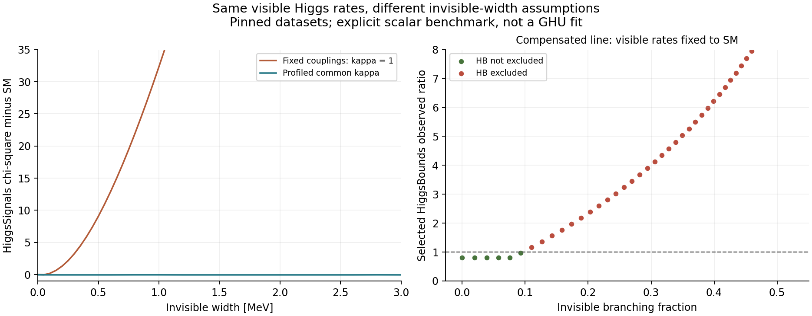
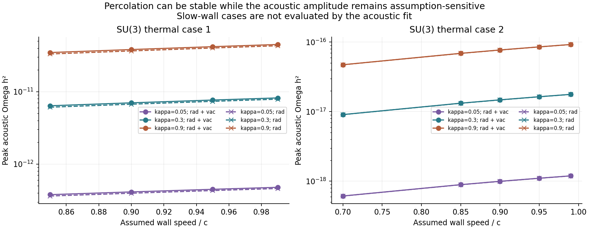
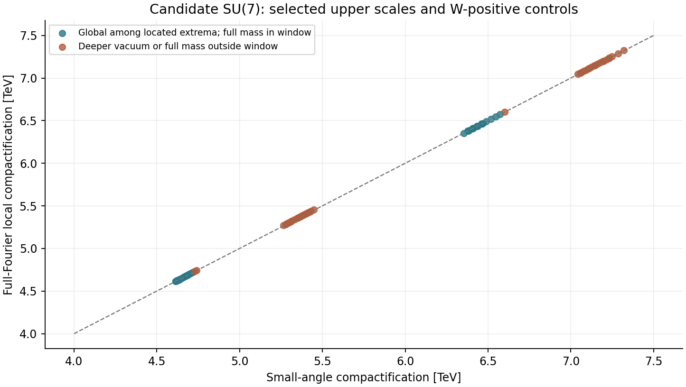

# 🔬 Three questions tested with the laboratory — 7 October 2026

The integrated transition history and conditional SU(7) certificates are available in the existing
panels. This report uses the same engines for three reproducible studies. The batch scans below are
command-line studies with archived results; they are not additional interactive panels.

| Question | Calculation | What the result establishes |
|---|---|---|
| Do visible Higgs rates determine an invisible width? | 2,646 actual evaluations of the pinned HiggsTools engine | Coupling assumptions change the answer; the common-coupling compensation is numerically flat in HiggsSignals, while selected HiggsBounds limits constrain it |
| Does a stable percolation temperature fix the acoustic amplitude? | 160 thermal scenarios across two SU(3) benchmarks | The temperature varies little over the supported acoustic cases, while the peak amplitude spans factors of 124 and 151 |
| Does a high small-angle compactification scale survive the full potential? | 6,227,070 enumerated candidate contents; 80 selected full-Fourier checks | 37 selected representatives retain a preferred small-angle vacuum and a full Higgs mass in the window; 42 have a deeper competing vacuum |

The [records and figures](../research/2026-10-07/README.md) preserve the inputs, selection rules,
budgets and numerical results. Twelve checks validate their internal consistency and comparison
with the existing reference calculations. These twelve are separate from the application suite.

## 🧪 Higgs: a constraint depends on what is allowed to vary

The scalar has mass 125.2 GeV. A common positive κ rescales κV, κF, κg, κγ and κZγ, and an independent
invisible width is supplied. All production cross sections and visible partial widths then scale
as κ². The visible signal strength is

```text
μvisible = κ⁴ ΓSM / (κ² ΓSM + Γinv)
Γinv = ΓSM (κ⁴ − κ²)  ⇒  μvisible = 1.
```

This is the known coupling/width degeneracy, reproduced with the actual experimental evaluator,
not a new identity. See the [HiggsSignals coupling study](https://arxiv.org/abs/1403.1582) and
[official HiggsSignals API](https://higgsbounds.gitlab.io/higgstools/HiggsSignalsAPI.html).

| Quantity | Recorded result | How to read it |
|---|---:|---|
| SM reference width | 4.115880041 MeV | The value from the pinned HiggsPredictions engine |
| SM HiggsSignals χ² | 151.642065212 | 159 observables; this is not a count of independent degrees of freedom |
| Best common κ at Γinv=0 | 0.995859191 | χ²=151.587796747; Δχ² relative to SM is −0.054268465 |
| Largest absolute Δχ² on the compensated line | 2.84×10⁻¹⁴ | κ=1…1.45, 46 points with all visible rates fixed to the SM |
| Fixed κ=1 crossing at Δχ²SM=4 | Γinv=0.332431522 MeV | A diagnostic crossing, not a reported 95% confidence limit |
| HiggsBounds verdict changes along the compensated line | Between κ=1.05 and 1.06 | A bracket on this sampled scenario; selected analyses and ratios are stored per point |



The left plot compares fixed couplings with profiling over a common κ. The right plot shows the
selected HiggsBounds observed ratio along the compensated line; its exclusion threshold is one.
HiggsBounds chooses limits using expected sensitivity. Its verdict is not added to the
HiggsSignals χ² as another likelihood term. The profile is restricted to κ∈[0.8,1.5] and
Γinv∈[0,10] MeV. No global p-value or two-parameter confidence contour is assigned.

At both ends of the κ=1.05…1.06 bracket, HiggsBounds selects the
[ATLAS invisible-Higgs combination, arXiv:2301.10731](https://arxiv.org/abs/2301.10731), whose
13 TeV sample has 139 fb⁻¹. The recorded observed ratios are 0.967914 and 1.165110 respectively.
Those are evaluator outputs for the rescaled-production scenario; they are not the paper's
branching-ratio limit with Standard-Model production assumed.

The official datasets include ATLAS and CMS results, and their commits and hashes are archived.
An older analysis can be selected at a particular point; a selected limit is not a statement that
every dataset entry is from that period. These are evaluations of a specified scalar scenario,
without a GHU action relating all its couplings, masses and widths.

## 🌡️ Thermal history: separate integration stability from wall assumptions

The same refined PhaseTracer actions are reused for each case. The scan varies eight wall speeds
(0.1, 0.3, 0.5, 0.7, 0.85, 0.9, 0.95, 0.99), five fluid efficiencies
(0.05, 0.1, 0.3, 0.5, 0.9), and two expansion backgrounds. Radiation plus a constant false-vacuum
energy and radiation alone are distinct supplied cosmological assumptions; g*=106.75 throughout.

| Benchmark | Scenarios | Acoustic estimates supported | Tp range for those cases [GeV] | Peak ΩGW h² range | Maximum / minimum |
|---|---:|---:|---:|---:|---:|
| SU(3), case 1 | 80 | 40 | 90.20953…90.55804 | 3.61621×10⁻¹³…4.48811×10⁻¹¹ | 124.11 |
| SU(3), case 2 | 80 | 50 | 25.14676…25.14826 | 6.12552×10⁻¹⁹…9.24371×10⁻¹⁷ | 150.90 |



The figure shows three efficiencies; the JSON retains all five. Unsupported acoustic cases have
null peak fields and an explicit reason. They are not zero-signal predictions. The fit requires
completion, trace-anomaly strength α≤1 and a wall faster than the bag-model Jouguet speed.
The amplitude ranges are scenario envelopes, not confidence intervals or detector forecasts.

In the app, open **Simulator → SU(N) builder → Integrated nucleation, percolation and conditional
gravitational waves**. Use case 1, save a comparison, then change efficiency from 0.5 to 0.1.
The supplied efficiency changes the acoustic estimate without changing the bubble-growth history.
Changing wall speed can change the history and can withdraw the acoustic fit when its domain is
not satisfied. The [equations, default numbers and convergence checks](research-extensions.md#integrated-transition-history)
explain the cosmological approximations and the separate roles of nucleation, percolation and
completion. These SU(3) calculations are not the thermal history of the SU(7) builder.

## 🔎 Candidate SU(7): test the vacuum after the moment map

The finite search uses the candidate seed, mW=80.4 GeV, g4=0.63, and an approximate Higgs window
[123,127] GeV. The conditional moment certificates bound A4 at 272.5 for k=2 and 375.5 for k=4.
The k=2 enumeration finishes within that region. The k=4 enumeration stops at the explicit
5,000,000-content budget. Contents sharing all five coordinates (A4, D8, U2, V, W2) are grouped:
they have the same full one-loop potential. Grouping by the two observable coordinates alone
would lose the potential's W direction.

For each rung, the full-potential selection takes the 20 highest approximate scales and 20
highest-scale W2>0 controls, deduplicated by all five coordinates. A positive W is a selection
control, not a proof that the vacuum is global. NumPy/SciPy independently locates stationary
points and compares potential values at 1,024 and 2,048 Fourier terms, including tail bounds.

| Candidate rung | Contents enumerated | Approximate mass-window hits | Distinct full potentials among hits | Representatives checked | Preferred vacuum and full mass in window | Deeper vacuum found |
|---|---:|---:|---:|---:|---:|---:|
| k=2 | 1,227,070, finished | 5,183 | 139 | 40 | 19 | 20 |
| k=4 | 5,000,000, budget reached | 8,880 | 217 | 40 | 18 | 22 |



One additional k=2 representative has a full mass outside the window. The highest tested scales
with a preferred vacuum and an in-window full mass are 6.574128 TeV for k=2 and 4.719317 TeV for
k=4. These are witnessed values within this selection, not proven optima. “Preferred” means
lowest among the numerically located extrema, not interval-certified isolation of every root.

The approximate mass prefilter can miss points that move into the window when evaluated with the
full potential. The selection tests only 80 representatives, and the k=4 search is budget-limited.
Neither the finite search nor the small-angle certificates establish a universal full-potential
ceiling. Anomaly, flavour and common collider matching are additional requirements.

## 🏗️ What is implemented, and what would expand the instrument

| Capability | Current state | Useful next extension |
|---|---|---|
| Conditional rung bounds | Interval certificates and scoped browser table | Interval isolation of full-potential extrema and a remainder bound suitable for a global ceiling |
| Candidate screening | Reproducible batch search, grouped by the five potential coordinates | A resumable browser/engine queue that tests each distinct potential once and reports budget, rejected candidates and undecided cases |
| Higgs constraints | Individual interactive scenarios and an archived common-κ profile study | Interactive profile scans with explicit fixed/profiled parameters and the selected experimental analysis at every point |
| Thermal transition | Integrated history and acoustic estimates with supplied wall/efficiency inputs | A plasma/friction and reheating calculation before interpreting amplitude ranges as predictions |
| Joint GHU interpretation | Separate, named model calculations | Specify one action, spectrum, Yukawa sector and uncertainty model, then construct the common likelihood |

The batch tools already make the first three studies reproducible. The proposed queue, interactive
profiles, dynamical wall calculation and full joint likelihood are not implemented by this release.

## ♻️ Reproduce the studies

Use the pinned scientific image built by `python tools/backend.py setup` for HiggsTools; the
thermal scan and inverse search use Node, and the independent vacuum checks and figures require
Python with NumPy, SciPy and matplotlib. From the repository root in PowerShell:

```powershell
docker run --rm --mount "type=bind,source=$($PWD.Path),target=/work" ghu-lab-scientific:20261006 python /work/tools/explore_higgs_degeneracy.py /work/research/2026-10-07
node tools/explore_thermal_assumptions.mjs research/2026-10-07
node tools/explore_candidate_rungs.mjs research/2026-10-07
python tools/check_exploration_vacua.py research/2026-10-07
python tools/plot_exploration.py research/2026-10-07
```

The last command checks the records and writes the figures and `summary.json`. The Higgs study
records the backend and dataset versions; the thermal study uses the checked-in refined actions.
The vacuum record retains the selected content and both Fourier resolutions. The
[artifact inventory](../research/2026-10-07/README.md) describes every output and its units.
